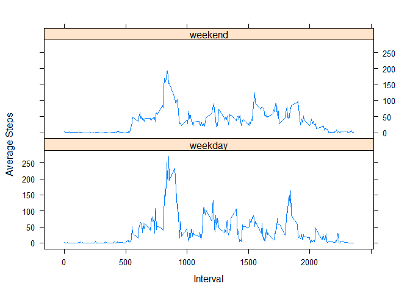

## Loading and preprocessing the data

```r
library(dplyr)
library(lubridate)
library(lattice)
```

```r
data <- read.csv(unzip("activity.zip"))
data$date <- as.Date(data$date, "%Y-%m-%d")
```

## What is mean total number of steps taken per day?
This histogram shows how many steps where taken on how many days 
when we ignore NA values.

```r
stepsPerDay <- tapply(data$steps, data$date, sum, na.rm=TRUE)
hist(stepsPerDay, xlab="Number of steps", ylab="Number of days", main=NULL)
```

<!-- -->

This results in the following summary,
where you also see the mean and median number of steps per day:

```r
summary(stepsPerDay)
```

```
##    Min. 1st Qu.  Median    Mean 3rd Qu.    Max. 
##       0    6778   10395    9354   12811   21194
```


## What is the average daily activity pattern?
The next diagram shows the average activity in every 5 minute interval on an average day.

```r
stepsPerDayAndInterval <-
    data %>%
        group_by(interval,date) %>%
        summarise(steps = mean(steps, na.rm = TRUE)) %>%
        summarise(steps = mean(steps, na.rm = TRUE))    

plot(stepsPerDayAndInterval$interval,stepsPerDayAndInterval$steps, type="l",
     xlab = "5 Min Interval", ylab="Number of Steps")
```

<!-- -->
On an average day, the most activity is recorded in the following interval.

```r
top_n(stepsPerDayAndInterval, n=1, wt=steps)
```

```
## # A tibble: 1 x 2
##   interval steps
##      <int> <dbl>
## 1      835  206.
```
## Imputing missing values
In total we have the following count of NA numbers.

```r
sum(is.na(data$steps))
```

```
## [1] 2304
```
To impute the missing values, we replace them by the average number of steps 
in the same interval on the same weekday.

```r
dataWithImpute <- data %>%
    group_by(interval,wday(date)) %>%
    mutate(meanValue = mean(steps, na.rm = TRUE))
dataWithImpute[is.na(dataWithImpute$steps),]$steps <- 
        dataWithImpute[is.na(dataWithImpute$steps),]$meanValue
```
Now we do the same analysis as before but with the imputed values.

```r
stepsPerDayWithImpute <- tapply(dataWithImpute$steps, dataWithImpute$date, sum, na.rm=TRUE)
hist(stepsPerDayWithImpute, xlab="Number of steps", ylab="Number of days", main=NULL)
```

<!-- -->

This results in the following summary,
where you also see the mean and median number of steps per day:

```r
summary(stepsPerDayWithImpute)
```

```
##    Min. 1st Qu.  Median    Mean 3rd Qu.    Max. 
##      41    8918   11015   10821   12811   21194
```


## Are there differences in activity patterns between weekdays and weekends?
Now we compare the different activities on weekend and weekdays.

```r
toDayType <- function(date) {
    ifelse (wday(date) %in% range(2,6),
            "weekday","weekend")
}
dataWithImpute <- dataWithImpute %>%
    mutate(dayType = toDayType(date))
dataWithImpute$dayType <- as.factor(dataWithImpute$dayType)
dataWithImputeByInterval <- 
        dataWithImpute %>%
        group_by(interval,dayType) %>%
        summarise(steps = mean(steps))

with(dataWithImputeByInterval,
     xyplot(steps ~ interval | dayType,
            xlab = "Interval", ylab = "Average Steps",
            type = 'l',
            layout = c(1,2)
           ))
```

<!-- -->
